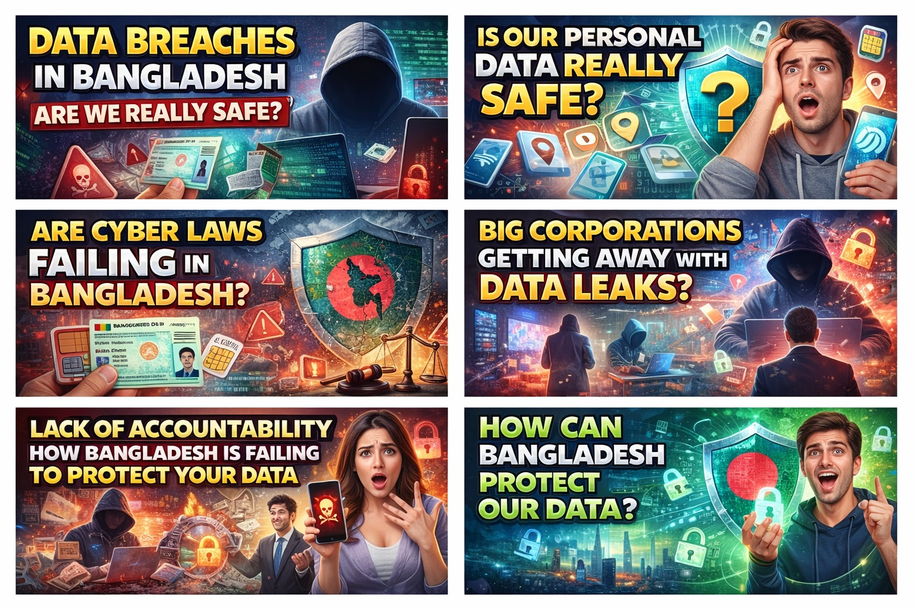
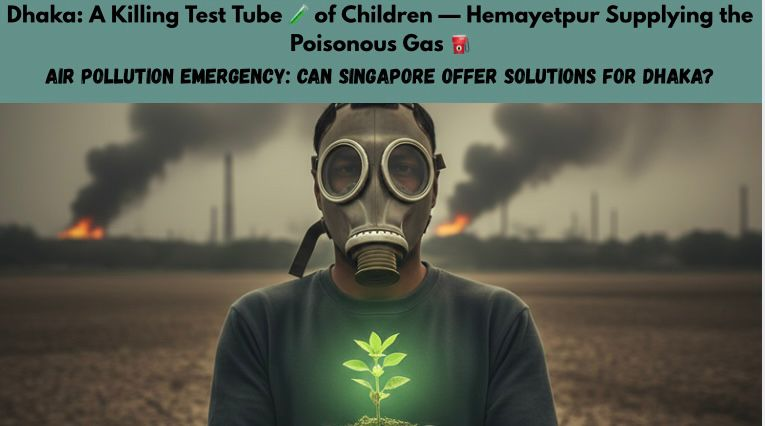
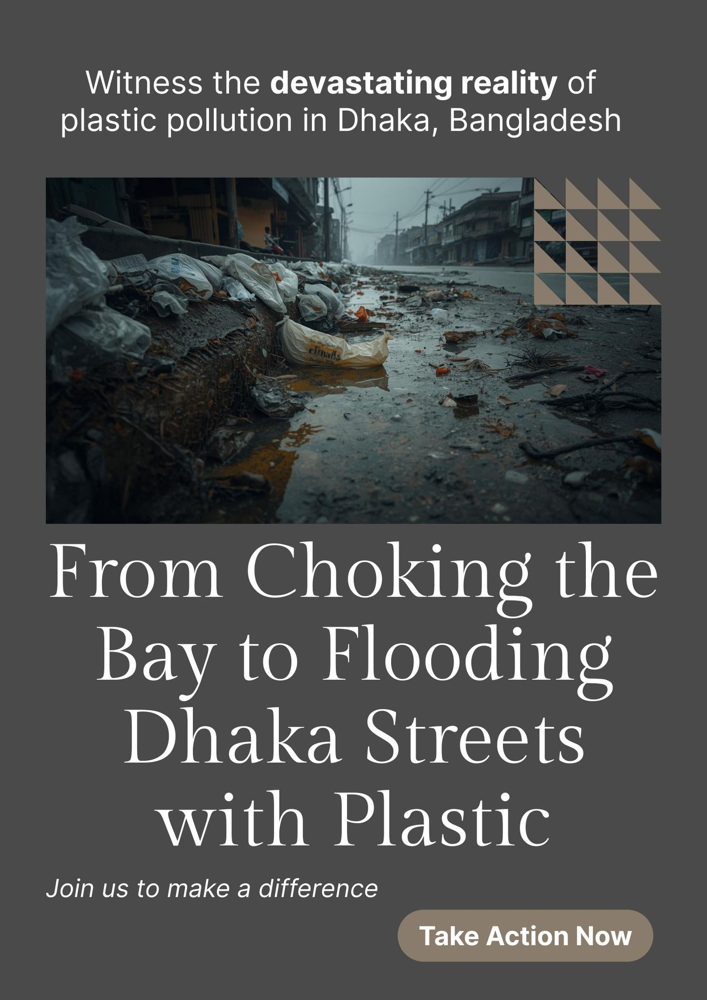
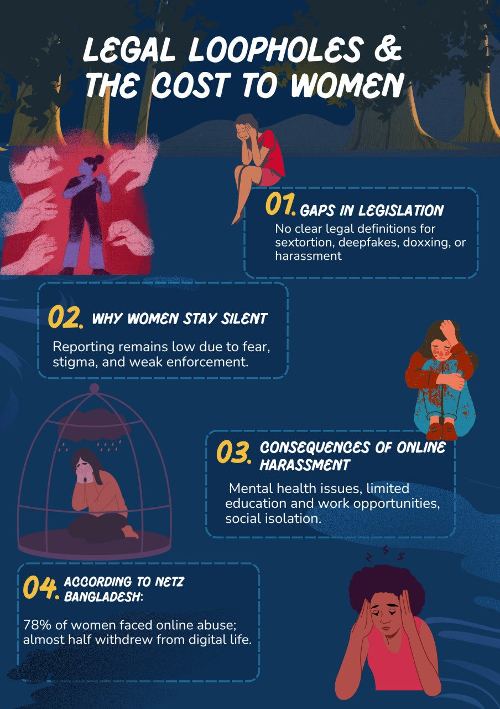
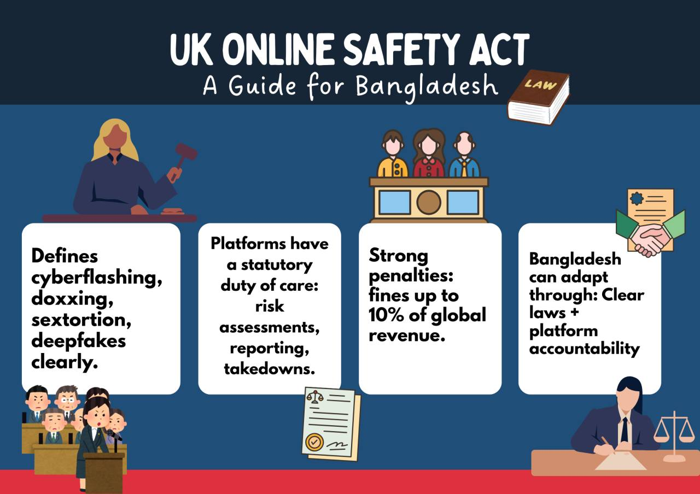
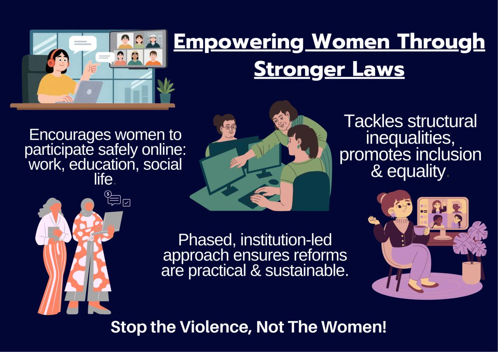
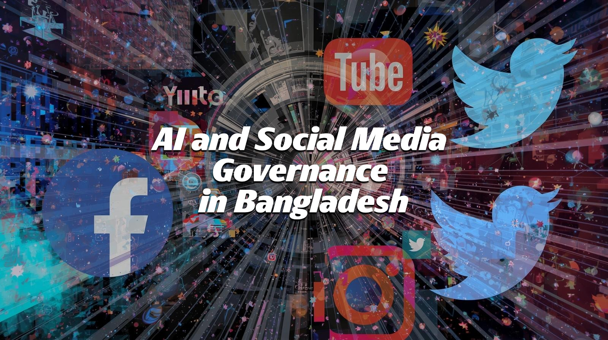
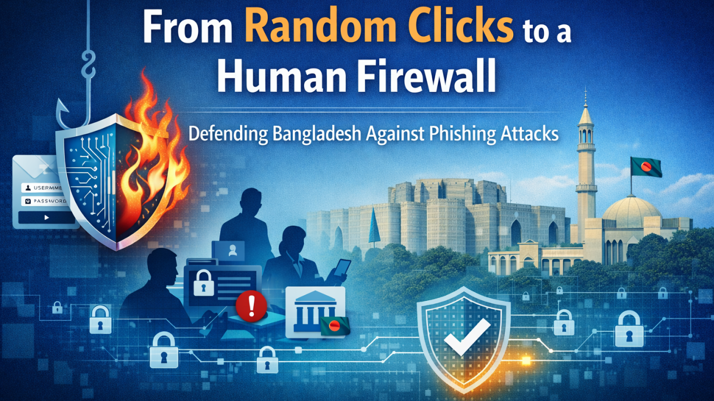

## From Facebook Page of GSI
Governance and Security Initiative - GSi 
Independent think tank and training academy on governance, national security, cybersecurity & AI policy.
From Bengal to beyond . . .

Page · Nonprofit organization

Shyamoli, Road 1, House 7/7, Dhaka, Bangladesh

Posts:
1. Asheer Shah, Founder and Director of the Governance and Security Initiative, appeared on The Daily Star Live to discuss the evolving technological dimensions of the US–Israel–Iran conflict.
During the discussion, he highlighted the growing role of spyware, cyber warfare, and emerging AI-powered weapons in shaping modern battlefields.
LIVE: Wars Today: We need to talk about Big Brother an AI | The Daily Star Geopolitical Insights See less
LIVE: Wars Today: We need to talk about Big Brother an AI | The Daily Star Geopolitical Insights
Please join us on this live discussion as we discuss about the US-Israel’s war on Iran. Please comment with your questions and angles you want covered, and join us for an open discussion.
https://web.facebook.com/DailyStarNews/videos/3556201781198145

2.
Modern warfare is entering a new era.
The battlefield is no longer defined only by tanks, missiles, and soldiers. It is increasingly shaped by artificial intelligence, autonomous weapons, cyber operations, and mass surveillance technologies.
Tonight, Asheer Shah, Director of the Governance and Security Initiative (GSi), will join The Daily Star for a live discussion on the evolving US–Israel–Iran strategic confrontation and the technologies transforming modern conflict.
From cyber operations such as Operation Olympic Games cyberattack to controversial surveillance tools like Pegasus Spyware, digital espionage is now a central component of geopolitical competition.
At the same time, the world is witnessing the rapid rise of physical AI-driven weapons systems — autonomous drones, intelligent targeting platforms, robotic combat systems, and algorithmic battlefield decision-making.
Together, these technologies are redefining how power is projected, how wars are fought, and how nations compete in the 21st-century security environment.
🕗 Monday, March 9 | 8 PM
📡 Live on Geopolitical Insights by The Daily Star
The Governance and Security Initiative continues to contribute to critical global conversations on cyber governance, AI security, emerging warfare technologies, and geopolitical stability.
#Geopolitics #AIWarfare #CyberSecurity #AutonomousWeapons #Spyware #GlobalSecurity #GSi

3.
Governance and Security Initiative - GSi is at Agargaon, Dhaka - আগারগাঁও, ঢাকা.
rdnoosStep
a
u570
5
h1
 
c
5
h1g4c
r
3lc
M
0
a
5
t
f
:
 
10iu
4
 
2
P
h
M
f
 
0h72c
1
ca2g
 ·
The Governance and Security Initiative (GSi) has announced a community-focused environmental initiative following a recent site visit to the polluted canal beside the Liberation War Museum in the Shyamoli–Agargaon area of Ward 28.
During the visit, the Director of GSi personally inspected the site and documented the current environmental conditions. Observations from the visit indicate that the canal has deteriorated into a toxic dumping ground and mosquito breeding zone, posing significant environmental and public health risks for local residents, particularly children. The condition of the canal highlights ongoing concerns related to urban waste disposal, stagnant water, and environmental neglect in the surrounding community.
In response, GSi has announced plans to initiate a community-driven effort to clean and rehabilitate the canal, with the long-term objective of transforming the surrounding area into a green public park and recreational space. The initiative aims to restore the canal environment while creating a safe and accessible public space where residents can walk, relax, and engage in community activities such as recreational fishing.
According to GSi, the proposed project reflects the organization’s broader commitment to good governance, environmental sustainability, and community-centered urban development. The initiative also seeks to demonstrate how local community engagement and collective action can help address environmental challenges and improve the quality of life in urban neighborhoods.
To support the initial cleanup and restoration activities, GSi has announced that it is seeking donations and public support from community members and stakeholders. The organization emphasized that active community participation will be critical to ensuring the long-term success and sustainability of the initiative.
GSi hopes that this project can serve as a community-led model for urban environmental revitalization, showing how neglected public spaces can be transformed into healthy, safe, and environmentally sustainable community assets.
A video briefing from the site visit has been released to raise awareness about the issue and to encourage broader public engagement with the initiative.
#ward28 #SHYAMOLI #Agargaon #cleancanal #greenpark
https://web.facebook.com/reel/1844792949512928/?s=single_unit

5. Asheer Shah, Founder and Director of the Governance and Security Initiative (GSi), has launched a community-driven digital access initiative in Ward 28 (Shyamoli–Agargaon) aimed at bridging the digital divide among underserved populations.
As part of this initiative, free public WiFi zones have already been successfully established in three slum communities within Ward 28 to support students, youth, and residents with access to online education, employment opportunities, and essential digital services.
Following the positive response from local residents — including students, youth, and families — plans are currently underway to expand the program to at least ten such communities in the coming phase.
This initiative reflects an ongoing commitment to inclusive development and community empowerment through accessible digital infrastructure.
https://deshkalbd.com/education/2178

6. From Random Clicks to a Human Firewall: First-Order Defenses Against Phishing in Bangladesh
Written by: Abul Kasem, Governance Researcher at GSi
Phishing in Bangladesh is no longer a minor IT irritation. It is a trust and stability problem that converts ordinary messages into stolen credentials, diverted payments, and disrupted services. A convincing SMS about a blocked account or a counterfeit login page can prompt customers or employees to do the attacker’s work. At scale, such incidents erode confidence in digital channels.
This article focuses on three actors that can reduce phishing losses without waiting for new national platforms: BGD e-GOV CIRT, the ICT Division, and banks. Drawing on Peter A. Hall’s (1993) policy-paradigms framework, the strategy proposed here is one of first-order change—strengthening existing routines (awareness, access control, verification, and incident response) rather than redesigning institutions.
The discussion centers on four themes:
1. Phishing as a trust problem
2. Costs and legal constraints
3. First-order fixes within existing routines
4. What changes when clicks stop
Phishing as a trust problem
Phishing spreads faster than manual verification. Attackers exploit urgency, authority, and familiarity, often using local language, realistic branding, and recycled personal details from previous data leaks. A single click can trigger credential theft, account takeover, unauthorized transactions, and extensive recovery work.
The impact is broad but concrete. For banks, it affects customers, branch employees, call-center representatives, and service partners. For the government, it affects citizens who rely on e-services and officials who manage public information. Because social engineering remains a primary entry point, reducing phishing exposure is one of the most cost-effective ways to lower overall cyber risk (Verizon, 2024).
Costs and legal constraints
Phishing generates three main costs.
First, operational drag: staff slow down to re-check messages, reset passwords, and quarantine devices. Second, financial loss: fraud, chargebacks, dispute resolution, and incident-response labor. Third, reputational damage: when users feel unsafe, they avoid apps and portals, distrust legitimate alerts, and lose confidence in digital services.
Legal and regulatory expectations raise the stakes but cannot prevent phishing alone. Bangladesh’s cybercrime framework rests primarily on the Cyber Security Act 2023 (DataGuidance, 2024) and provisions of the Information and Communication Technology Act 2006 (as amended), which remains a key reference for cyber offences and digital evidence (Ali, 2018). In the financial sector, Bangladesh Bank’s cybersecurity directives for banks, NBFIs, and mobile financial services treat cyber incidents as systemic stability risks (The Daily Star, 2025).
The practical question is straightforward: who bears the cost when phishing succeeds? Customers lose funds and time. Banks absorb fraud losses and support surges. Public agencies suffer service disruption and erosion of trust. SMEs face downtime and lost revenue. The most cost-effective intervention point is the moment of decision—the second before a click becomes a credential leak.
First-order fixes within existing routines
The quickest gains come from adjusting defaults and habits within routines that already exist. Effective anti-phishing programs consistently: 
1. Reduce risky choices
2. Make safe choices easier
3. Shorten the path from suspicion to reporting.
These improvements do not require new national systems—only disciplined refinement.
BGD e-GOV CIRT: Transform advisories into concise, localized checklists: what the scam looks like, the key red flag, and what action to take. Include one official reporting channel and one safe verification method in every alert. Publish a weekly “top three scam patterns” update and maintain a single, bookmarkable page for staff and citizens (BGD e-GOV CIRT, 2024).
ICT Division: Standardize minimum security routines across government offices: multi-factor authentication for official email, a two-channel verification rule for account or payment changes, and a defined incident workflow. Provide ready-to-use templates (one-page playbooks, staff scripts, monthly micro-quizzes) so compliance is practical and measurable. Short, repeated practice builds resistance over time (Toth et al., 2025).
Banks: Convert guidance into enforced defaults. Require multi-factor authentication for high-risk roles and administrative tools. Double-verify beneficiary changes and urgent payment requests, particularly when initiated through email or messaging platforms. Replace annual awareness sessions with weekly micro-practice and promote a non-punitive reporting culture through a “Report Phish” button, hotline, and rapid escalation procedures.
These are incremental adjustments. Clearer alerts reduce clicks. Standardized verification reduces diverted payments. Faster reporting improves containment. Over time, strengthened routines also inform smarter investments and policy refinement.
What changes when clicks stop
When BGD e-GOV CIRT, the ICT Division, and banks coordinate first-order improvements, the loss chain becomes a benefit chain. Fewer successful phishing attempts mean fewer account takeovers, fewer fraud disputes, and less operational friction.
Citizens gain safer and more predictable digital services. Banks experience lower fraud losses and improved customer trust. Public agencies maintain service continuity and reduce incident burdens. SMEs become more resilient—without expensive new infrastructure.
Bangladesh does not need to wait for comprehensive cybersecurity modernization to reduce phishing losses. Immediate gains are achievable by refining what already exists: clearer alerts, standardized routines, safer defaults, and rapid reporting cultures. When these practices become embedded, random clicks cease to be a systemic vulnerability and instead contribute to a national human firewall.
References
Ali, B. G. S. M. R. (2018). Digital evidence: An approach to safeguard cybercrime in Bangladesh. NDC Journal, 16, 63–78.
BGD e-GOV CIRT. (2024). Official website (alerts and guidance).
DataGuidance. (2024, March 4). Bangladesh: Government enacts Cybersecurity Act 2023.
Hall, P. A. (1993). Policy paradigms, social learning and the state: The case of economic policymaking in Britain. Comparative Politics, 25(3), 275–296.
The Daily Star. (2025, July 30). BB issues 17-point cybersecurity directive amid rising threats. The Daily Star.
Toth, R., Weidman, J., & Quigley, B. (2025). Using emotional triggers to enhance continuous phishing training (Preprint). arXiv.
Verizon. (2024). 2024 data breach investigations report (DBIR).

8. Dhaka: A Killing Test Tube 🧪 for Children — Hemayetpur Supplying the Poisonous Gas ⛽️
Air Pollution Emergency: Can Singapore offer solutions for Dhaka?
Written by: Syeda Nafisa Anjum
The Ministry of Environment, Forest and Climate Change took a brilliant initiative—asking citizens to email photos of individuals burning plastic and rewarding them for it. However, landfill operators continue to burn waste with impunity while regulatory authorities like the Ministry of Environment, Forest and Climate Change and the Ministry of Health and Family Welfare issue warnings without enforcement (Yousuf & Samsuzzaman, 2025). 
Dhaka is now engulfed in toxic smoke rising from burning landfills in Hemayetpur, Savar, and Nabinagar and breathing this air is equivalent to smoking 22 cigarettes per day (Urme et al., 2021; Bhuiyan, 2025). A large number of children suffering from asthma, bronchitis, and pneumonia are flooding the hospitals of Bangladesh (Tajmim, 2019). Over 19000 children under the age of five died in 2021 alone from diseases caused by pollution (UNICEF, 2024). 
The scale of the crisis is staggering. The waste piles at the Aminbazar landfill sometimes reach up to 90 feet high, and burning these waste in open spaces leads to approximately 11% of the air pollution of the city (Dhaka North City Corporation, 2024).The 2024 IQAir Global Air Quality Report reveals that Bangladesh ranks second worst in the world for air quality, following closely behind Chad. Despite the magnitude of the issue, no one is held accountable for their actions, and no significant measures are taken to mitigate the problem. 
On account of such, can Singapore’s waste to energy model offer a solution for Bangladesh? This article examines the crisis through three lenses:
1. The Human and Economic Costs of Landfill Pollution
2. Waste-to-Energy Solutions from Singapore 
3. Bangladesh Must Act Now
The Human Costs of Landfill Pollution
Burning wastes release a mix of harmful elements which have severe consequences on the health of the citizens. Burning of polyethylene, paper, fallen leaves, and plastic waste are common scenarios of areas like Aminbazar and Matuail. As a result of which, toxic byproducts such as dioxins and furans are released into the atmosphere which are linked to cancer, neurological disorders, and chronic illnesses (Hossain, 2025). 
A Canadian company called GHGSat, which employs high-resolution satellites to monitor emissions, disclosed that the Matuail landfill emits around four tonnes of methane per hour (Amin, 2021). The carbon footprint roughly aligns with that of 190,000 cars on the road. 
People living in close proximity of these landfills are suffering from various health risks, including asthma, diarrhea, skin diseases, bronchial infections, pneumonia, headaches, and loss of appetite (Urme et al., 2021; Alam, 2026). Professor Kamruzzaman, an Associate Professor in Respiratory Medicine asserts that children are highly vulnerable to pneumonia and respiratory complications. 
Moreover, according to Aresfin & Shafiullah (2023), air pollution also contributes to mental health disorders such as anxiety, depression, Alzheimer’s, and Parkinson’s disease. Findings from the 2024 report from the World Bank suggest that the long-term consequences of this air pollution are equally catastrophic as it causes around 80,000 premature deaths annually in Bangladesh (World Bank, 2024).
The environmental and social impacts cannot be ignored. Leachate contaminates soil and groundwater, undermining agriculture, while nearby rivers and canals are polluted, threatening fisheries and water supplies. Persistent foul odors degrade the quality of life, and property values in surrounding communities plummet. Socially, residents endure stigma, stress, and ongoing health burdens from living near these landfills.
Waste-to-Energy Solutions from Singapore 
Singapore offers a convincing solution of how waste can be handled in urban regions without compromising public health. All wastes are efficiently collected by the Public Waste Collectors (PWCs) appointed by the National Environment Agency (NEA). These are then transported to specialized plants like Tuas South, TuasOne, Senoko, and Keppel Seghers which are equipped with advanced emission control technologies. The non-recyclable municipal solid wastes are incinerated in high-temperature, helping to reduce landfill volume by up to 90% and generating electricity for the national grid (Waste Management, 2025). 
Furthermore, the country has also targeted to achieve a 70% recycling rate and 30% reduction in the wastes disposed in Semakau landfill under the Green Plan 2030. The National Environmental Agency is also developing the Integrated Waste Management Facility (IWMF), situated along the Tuas Water Reclamation Plant. It is expected to be completed by 2028 and will combine waste treatment with water reclamation, thus maximizing resource efficiency and minimizing environmental impact (Data Insights Market, 2025). 
The success of Singapore highlights that, with advanced technology, strict regulatory oversight, and long-term planning a country can transform its waste crisis into a system that simultaneously generates sustainable energy and safeguards public health (Waste Management, 2025).
Bangladesh Must Act Now
The Ministry of Environment, Forest and Climate Change, along with the Ministry of Health and Family Welfare, must strictly enforce the Air Pollution Control Rules (2022), which prohibit open burning and the stockpiling of waste near residential areas. Authorities should shift their perspective and recognize waste as a valuable resource rather than a burden. Adopting a Waste-to-Energy (WtE) model can significantly reduce landfill pressure while generating electricity. 
Bangladesh can seek technical assistance from experienced countries such as Singapore to gain expertise in plant design, emission-control technologies, and regulatory frameworks. It can also train local engineers through knowledge-exchange initiatives. Simultaneously, small-scale Waste-to-Energy facilities can be set up in major urban landfill zones to evaluate environmental safety, technical performance, and economic feasibility before nationwide expansion. 
Through Public–Private Partnership (PPP) models, the government can provide land, regulatory support, and oversight, while private firms contribute investment, technology, and operational management, ensuring efficient implementation. Such measures would not only help mitigate the severe health risks currently faced by citizens but also contribute to easing the country’s electricity shortage. The example of Singapore demonstrates that effective waste management is less a question of technological availability and more a matter of strong governance, regulatory enforcement, and long-term political commitment.
While the landfill operators profit and authorities turn a blind eye, it is the regular people who pay the price with their health and life. Every plume of smoke rising from Hemayetpur, Aminbazar, and Matuail carries hazardous substances that steal childhoods and shorten lifespans. What was once seen as just an environmental problem has now grown into a moral crisis. Clean air should not be treated as a privilege, but a right of every child. The people of Bangladesh deserve clean air, safe communities, and a government that values their lives.
Stop the fumes. End the dooms.
References
Alam, H. (2025, April 11). Caught in toxic grip of a landfill. The Daily Star. 
Amin, M. A. (2021, April 29). Matuail landfill emits 4 tonnes of methane every hour: “Unbelievable” say experts. The Business Standard.
Aresfin, N., & Shafiullah, M. (2023, October 27). Dhaka’s air pollution is worsening children’s mental health. The Business Standard.
aqi.in. (n.d.). Dhaka particulate matter (PM2.5) level: Real-time air pollution alerts. 
Hossain, I. (2025, February 10). Waste burning is quietly exacerbating Dhaka’s already dire air quality. The Business Standard.
Integrated Waste Management Facility. (2025, March 4). National Environmental Agency.
Islam, R. (2025, May 11). Tk10cr “safe landfill” project aims to curb Savar tannery pollution. The Business Standard. 
IQAir. (n.d.). Dhaka air quality index (AQI) and Bangladesh air pollution.
Dhaka among top 10 most polluted cities in the world. (2026, January 15). IQAir.
Mostafa Yousuf, & Samsuzzaman. (2025, April 10). How dangers intensify due to garbage burning in Dhaka. Prothomalo.
Safe, healthy and conducive living environment. (2021, November 15). National Environmental Agency.
Singapore Waste Management Industry Strategic Market Roadmap: Analysis and Forecasts 2026-2034. (2026, January 9). Data Insights Market.
Tajmim, T. (2019, October 7). Pollution plagues Dhaka life. The Business Standard.
Umali-Deininger, D. (2024, November 20). Clearing the Air: Addressing Bangladesh’s air pollution crisis. World Bank Blogs.
Urme, S. A., Radia, M. A., Alam, R., Chowdhury, M. U., Hasan, S., Ahmed, S., Sara, H. H., Islam, M. S., Jerin, D. T., Hema, P. S., Rahman, M., Islam, A. M., Hasan, M. T., & Quayyum, Z. (2021). Dhaka landfill waste practices: addressing urban pollution and health hazards. Buildings and Cities, 2(1), 700–716.
UNICEF Bangladesh. (2024, June 20). The disease burden of air pollution on children continues to rise in Bangladesh, according to latest State of Global Air 2024 report.
Waste management. (2025, October 😎. Ministry of Sustainability and the Environment.
World Bank Group. (2024, March 28). Addressing Environmental Pollution is Critical for Bangladesh’s Growth and Development.

9. Cyber Law and the Illusion of Protection: When Personal Data Is Leaked in Bangladesh, Who Is Accountable?
Written by: Nusrat Khan, Cybersecurity Researcher at GSi.
In the contemporary digital era, personal data has emerged as one of the most valuable and vulnerable assets of modern society (Solove, 2021). From mobile banking and ride-sharing applications to social media platforms and biometric SIM registration, individuals in Bangladesh routinely surrender vast amounts of personal information. Telecommunications giants such as Grameenphone (a subsidiary of the Norway-based Telenor Group), Robi Axiata, Banglalink, and digital service platforms like Pathao and bKash have become central actors in this data-driven ecosystem (UNCTAD, 2021). 
Government and regulatory authorities assert that cyber laws safeguard citizens from data misuse, cybercrime, and privacy violations. Bangladesh has made strides in this direction with key legislation including: the Cyber Security Ordinance, 2025 (gazetted May 2025, repealing the Cyber Security Act 2023 and governing cybersecurity, cyber incidents, offences, and national agencies), the Personal Data Protection Ordinance, 2025 (gazetted November 2025, effective from November 6, 2025, establishing data subject rights, consent requirements, sensitive data categories, and obligations for controllers/processors), and the National Data Governance Ordinance, 2025 (gazetted alongside, creating oversight for national data policies and compliance). The Bangladesh Telecommunication Regulatory Commission (BTRC) also contributes regulatory oversight. 
However, despite these advancements, the frameworks have repeatedly fallen short in holding powerful corporate data controllers accountable for breaches, leaks, and misuse of personal data (Greenleaf, 2014). Comparatively, in the European Union (EU), GDPR is often considered the champion in individual data protection. Can the EU’s GDPR provide a solution for the Ministry of Law, Justice and Parliamentary Affairs in Bangladesh? 
This article examines four key themes: 
1. Corporate data breaches in Bangladesh and their human cost 
2. Weak enforcement and the absence of corporate accountability 
3. GDPR as a benchmark: how are EU users better protected? 
4. The path forward: learning from global standards 
Corporate data breaches in Bangladesh and their human cost 
Over the past decade, and intensifying, recently Bangladesh has seen multiple reported data breaches involving corporate entities and digital service providers. Major telecommunications operators (Grameenphone, Robi, Banglalink) and mobile financial platforms (such as bKash) collect and store enormous volumes of sensitive data, including national identity information, call/detail records, location history, payment transactions, and user behavioral patterns (UNCTAD, 2021). 
Prominent examples include: 
The early 2025 cybersecurity breach at City Bank, where client financial statements and sensitive information were exposed due to session management vulnerabilities and weak authentication, with the data later appearing for sale on underground hacker forums. 
Ongoing allegations and reports of unauthorized access or leaks involving customer databases at major mobile financial and telecom providers, contributing to risks of SIM swapping and fraud. 
However, no significant cases of fines imposed on these banks, mobile financial service providers, or telecom operators have been recorded. Affected individuals face grave consequences: unauthorized SIM duplication enabling banking fraud, phishing campaigns, blackmail using leaked personal details, and identity theft. In a nation where digital literacy varies widely, many victims remain unaware of how or when their data was compromised, amplifying psychological distress, financial harm, and erosion of trust in digital services (Solove, 2021). 
Weak enforcement and the absence of corporate accountability 
A critical flaw in Bangladesh’s cyber and data protection framework, even under the newly introduced 2025 ordinances, remains the persistent weakness of enforcement mechanisms. Although these laws formally criminalize unauthorized access, mandate breach notification obligations, and impose statutory duties on data controllers and processors, their practical impact is severely limited by structural and institutional constraints. Regulatory and law enforcement agencies frequently lack the necessary technical expertise, institutional independence, and financial and human resources required to investigate and prosecute complex, large-scale corporate data breaches, particularly those involving multinational corporations or sophisticated digital infrastructures (Greenleaf, 2014). 
Moreover, enforcement efforts are often undermined by bureaucratic inertia, political influence, and fragmented regulatory authority, which together dilute accountability and delay corrective action. In practice, this creates a significant gap between the law “on the books” and the law “in action,” allowing corporate actors to treat compliance as a formalistic obligation rather than a substantive responsibility. The absence of consistent and visible fines further weakens deterrence, as corporations may calculate that the reputational and financial risks of non-compliance remain minimal. As a result, victims of data breaches are left with limited avenues for effective redress, while systemic failures in corporate data governance persist largely unchallenged. This enforcement deficit not only erodes public trust in the regulatory regime but also undermines the broader objective of establishing a rights-based and accountability-driven data protection framework in Bangladesh. 
GDPR as a benchmark: how are EU users better protected? 
The General Data Protection Regulation (GDPR) of the European Union is one of the most comprehensive data protection regulations in the world, which grants robust rights to individuals, imposes stringent substantive obligations on data controllers, and establishes strong enforcement mechanisms with substantial non-compliance penalties. At its core, the GDPR focuses on individual rights by granting data subjects enforceable rights such as access, rectification, erasure, data portability, and the right to object to data processing. These rights are not merely declaratory but are backed by procedural rights that allow individuals to effectively challenge any violation of data protection laws (Kuner et al., 2020). 
In addition, the GDPR imposes substantive obligations on data controllers, such as those relating to lawful processing, purpose limitation, data minimization, and accountability. The GDPR is perhaps most notable for requiring data controllers to notify supervisory authorities within a mandatory period of 72 hours upon becoming aware of a data breach. This provides a level of transparency that significantly raises the stakes of weak data security practices, which can result in substantial reputational and legal risks.  
Most importantly, these substantive obligations are backed by robust supervisory authorities that are empowered to investigate violations, issue binding orders, and impose administrative fines that can reach up to four percent (4%) of a company’s global annual turnover. The combination of enforceable individual rights, strict procedural duties, and severe financial penalties creates powerful incentives for compliance features that remain largely absent or weakly implemented in many other jurisdictions, particularly in developing regulatory contexts (Kuner et al., 2020). 
The path forward: learning from global standards 
Comparative models such as the European Union’s GDPR demonstrate that data protection can function as a rights-based regime only when supported by independent regulators, transparent procedures, and credible sanctions that alter corporate behavior. In contrast, Bangladesh’s current approach risks reducing data protection to a symbolic exercise one that signals compliance with global norms without delivering substantive safeguards for citizens. Without sustained investment in regulatory capacity, judicial oversight, and a culture of accountability, legal reforms alone will remain insufficient. 
Ultimately, protecting personal data is not merely a technical or regulatory challenge but a democratic necessity. In an increasingly digital society, the failure to ensure genuine data security undermines public trust, weakens individual autonomy, and erodes the rule of law itself. If Bangladesh is to move beyond the illusion of protection, it must shift from lawmaking as performance to enforcement as practice placing rights, accountability, and institutional integrity at the center of its digital governance framework.
If the European Union can hold global tech giants like Meta, Amazon, and Google accountable through hefty penalties, why cannot Bangladesh do the same? 
References 
Greenleaf, G. (2014). Asian data privacy laws: Trade and human rights perspectives. Oxford University Press. 
Kuner, C., Bygrave, L. A., & Docksey, C. (2020). The EU General Data Protection Regulation (GDPR): A commentary. Oxford University Press. 
Solove, D. J. (2021). Understanding privacy (2nd ed.). Harvard University Press. 
United Nations Conference on Trade and Development. (2021). Data protection and privacy legislation worldwide. 
Warren, S. D., & Brandeis, L. D. (1890). The right to privacy. Harvard Law Review, 4(5), 193–220. 
Legal Instruments (Bangladesh Cyber & Data Laws) 
Cyber Security Ordinance, 2025 (Ordinance No. 25 of 2025). Promulgated and published in the Bangladesh Gazette, Extraordinary, May 21, 2025 (pp. 4939–4970). Ministry of Law, Justice and Parliamentary Affairs. Repeals the Cyber Security Act, 2023. Official source: Department of Printing and Publications. English unofficial translation available via ResearchGate/SSRN (2025). 
Personal Data Protection Ordinance, 2025 (Ordinance No. 61 of 2025). Gazetted and effective from November 6, 2025. Bangladesh Gazette, Extraordinary, November 6, 2025. Ministry of Law, Justice and Parliamentary Affairs. Official source: Department of Printing and Publications. Key provisions establish data subject rights, consent rules, and obligations for data controllers/processors.
National Data Governance Ordinance, 2025 (Ordinance No. 60 of 2025). Gazetted November 6, 2025 (alongside the Personal Data Protection Ordinance). Bangladesh Gazette, Extraordinary, November 6, 2025. Establishes framework for national data governance, interoperability, and oversight authority. Official source: Department of Printing and Publications; see also related gazette excerpts on bdlaws.minlaw.gov.bd.

10. From Choking the Bay to Flooding Dhaka’s Streets with Plastic: Can Peter Hall’s Policy Paradigms Rescue DNCC?
Written by: Abul Kasem, Governance Researcher at GSi.
Edited by: Asheer Shah, Founder & Director at GSi.
Bangladesh was globally praised for banning thin polythene bags in 2002. Yet, more than two decades later, Dhaka’s drainage system continues to choke on cheap single-use plastics every monsoon—flooding streets and worsening already hazardous air quality. After even short bursts of rainfall, discarded plastic bags, food containers, and sachet packets move rapidly from shops and households into drains, canals, and open dumping sites. These plastics block inlets and pipes, turning city streets into temporary, contaminated canals. For many of these wastes, the final destination is the Bay of Bengal.
Open dumping and burning of plastic waste release toxins into soil, rivers, and air, intensifying Dhaka’s chronic air-pollution crisis (United Nations Environment Programme, 2018). Against this backdrop, can Peter Hall’s concept of first-order policy change offer a practical rescue strategy for Dhaka North City Corporation (DNCC)? This article argues that DNCC must act immediately by targeting consumer behavior at the source of plastic leakage, using two proven tools: “Pay for Plastic” and “Bring Your Own Bag” (BYOB) initiatives.
The discussion proceeds across three themes:
a) the monsoon tragedy,
b) behavioral approaches to plastic use, and
c) the vision of a Zero-Plastic Dhaka.
Monsoon Tragedy: How One Bag Becomes a Citywide Cost
In Dhaka, plastic bags travel quickly from checkout counters to drainage points. Consumers routinely receive multiple thin bags in a single shopping trip; these bags tear easily, are casually discarded, and are carried by wind and runoff into open drains and canals. During dry periods, plastics drape over grates and culverts like nets. When rain arrives, these same nets become plugs: inlets narrow, water stagnates, and streets flood. Pavements disappear, and contaminated water invades shops and ground-floor homes.
The costs are borne unevenly. DNCC officials are legally responsible for keeping streets clean and drains functional, yet they struggle to control the sheer volume of single-use plastics entering the waste stream. Informal waste workers handle mixed plastic waste without adequate protection, exposing themselves to contaminated water and toxic smoke. Low- and middle-income residents in flood-prone wards endure repeated waterlogging, unhygienic streets, and hazardous air.
Although the 2002 ban created national momentum, inexpensive plastic bags remain among the most damaging materials in Dhaka’s drainage network (Koros, 2023; The Daily Star, 2022). A pollution cycle emerges free plastic bags are discarded, drains clog, floods follow, and citizens pay the price through property damage, health risks, and polluted air. Ultimately, much of this plastic accumulates in the Bay of Bengal, polluting rivers along the way and entering freshwater fish ecosystems—posing serious risks to food security and public health.
Behavioral Change Approaches to the Plastic Problem
To break this cycle, DNCC can apply Peter A. Hall’s (1993) framework of three orders of policy change. First-order change adjusts existing policy instruments—such as user fees or enforcement—without altering overarching goals. Second-order change replaces instruments while keeping goals intact. Third-order change represents a paradigm shift, redefining both the problem and the goals themselves.
For Dhaka’s plastic crisis, first-order change offers the fastest and most politically feasible intervention. Without rewriting national policy goals, DNCC can deploy behavioral and pricing instruments to reduce single-use plastics at source.
Pay for Plastic
DNCC should introduce a uniform carrier-bag fee across all stores, supermarkets, chain outlets, and large bazaars. The fee must be clearly displayed at entrances and itemized on receipts, so consumers confront the cost at the moment of decision-making. Even modest charges disrupt the default behaviour of “just give me another bag” and make reusable bags the rational, low-cost alternative (World Bank, 2021b).
Bring Your Own Bag (BYOB)
DNCC should complement pricing with a citywide Bring Your Own Bag campaign that prioritizes practice over slogans. The city can facilitate behavior change by subsidizing low-cost, durable jute bags in supermarkets and large retail outlets. Targeted video campaigns on social media can further normalise reusable bags and embed long-term habits. Over time, BYOB must become part of Dhaka’s everyday consumer mindset rather than an environmental afterthought.
The Zero-Plastic Dhaka Dream
“Pay for Plastic” and “Bring Your Own Bag” are steppingstones toward a Zero-Plastic Dhaka. As fewer plastic bags accumulate in drains and canals, mixed-waste piles shrink, and open burning becomes socially unacceptable—contributing directly to improved local air quality (United Nations Environment Programme, 2018). Informal waste workers also benefit from reduced exposure to hazardous clearing operations.
Consumers gain in the long term as reusable bags reduce household waste burdens. DNCC, in turn, gains credibility when citizens recognize the link between a simple checkout rule and cleaner, drier streets—signaling a broader national commitment to eliminating polythene and single-use plastics (The Business Standard, 2024; World Bank, 2021a). Most importantly, reduced plastic consumption protects Bangladesh’s rivers and freshwater fish, safeguarding food systems and public health. Jute, in this sense, becomes the Bengal way of keeping the Bay clean.
Bring your own bag—and say no to plastic.
References
Habib, W. B. (2022, June 15). Cheaper polythene bags spell disaster for the environment. The Daily Star.
Hall, P. A. (1993). Policy paradigms, social learning and the state: The case of economic policymaking in Britain. Comparative Politics, 25(3), 275–296.
Islam, M. J., & Ahmed, F. (2024, November 1). Polythene bag ban takes effect today: What it means for users. The Business Standard.
United Nations Environment Programme. (2018). Single-use plastics: A roadmap for sustainability.
World Bank. (2021a). Bangladesh: Toward a multisectoral action plan for sustainable plastic management.
World Bank. (2021b, December 23). Meeting Bangladesh’s plastic challenge through a multisectoral approach.

11. Connected but Not Protected: Bangladesh Data Ordinance Act 2025, Legal Loopholes and the Costs to Women!
Written by: Syeda Nafisa Anjum, Digital Security Researcher at GSi.
Edited by: Asheer Shah, Founder & Director at GSi.
The digital landscape of Bangladesh has expanded rapidly in recent times, with millions of new users increasingly engaging on online platforms. While social media platforms have enhanced communication and access to information, they have simultaneously become hotspots for widespread harassment, stalking, and non-consensual sharing of personal content. The Personal Data Protection Ordinance of 2025, developed under the ICT Division of the Ministry of Posts, Telecommunications and Information Technology, represents an important step toward improved data governance and recognition of individual privacy rights (Rabbi, 2025). However, the Ordinance provides inadequate protection against digital violence, particularly against women.
According to UNDP’s Final Analysis of Technology‑Facilitated Gender‑Based Violence, women and girls are particularly vulnerable to cyber threats, often due to social stigma, digital illiteracy, and limited access to support. The consequences of online violence are far from abstract; they resonate deeply in women lived experiences, shaping their sense of safety and autonomy. Online violence also hinders women’s meaningful participation in digital spaces, damages mental health, restricts education and economic opportunities, and reinforces existing gender inequalities (On and Beyond the Screen: The Reality of Digital Violence, 2025). If left unaddressed, digital platforms risk evolving into arenas of exclusion rather than empowerment.
This article focuses on three key areas:
1) Legal Loopholes and the Costs to Women,
2) UK Online Safety Act as a Guide for Bangladesh, and
3) Empowering Users Through Stronger Laws.
Legal Loopholes and the Costs to Women
The Personal Data Protection Ordinance requires explicit consent for processing personal data, requiring that consent specify purpose, duration, recipients, transfer details, and withdrawal options (Khan, 2025). It establishes the National Data Governance Authority (NDGA) to conduct audits and enforce penalties of up to seven years imprisonment or 20 lakh Taka fines (Rabbi, 2025). Moreover, individuals are granted rights to withdraw consent fully or partially at any time, imposing legal responsibilities for data erasure (Rabbi, 2025).
Despite these measures, the Ordinance is predominantly focused on general data protection and expungement but does not specifically address digital exploitation and abuse that disproportionately affect women. It lacks precise definitions and corresponding measures for offenses like sharing intimate images without consent, doxing, sextortion, and orchestrated online harassment, which are overwhelmingly gendered in nature, often targeting women’s bodies, sexuality, and social reputation. This legal ambiguity creates accountability gaps, as differing interpretations of the provisions hinder consistent judicial action. Thus, allowing perpetrators to evade responsibility while leaving the victims without effective support.
Additionally, as highlighted by the Tech Global Institute (2023), there is also no legislative clause addressing the unauthorized sharing of non-sexual images or videos. While seemingly innocuous, these can inflict psychological distress, reputational damage, social isolation, and threats to personal safety. The rise of AI-generated and deepfake content has intensified these risks. UN Women highlights that such abuse escalates real‑world threats against female journalists and activists (Donmez, 2025).
In spite of this, reporting remains critically low due to fear of reprisal, shame, and uncertainty about law enforcement response. Alarmingly, a police‑commissioned survey in England and Wales revealed that 25% of adults were indifferent or unconcerned about creating or sharing sexual deepfakes without consent, highlighting widespread gaps in awareness (Weaver, 2025).
Therefore, these legislation and enforcement gaps significantly hinder women’s meaningful participation in the digital sphere as they face greater stigma, victim-blaming, and reputational consequences. According to a study by NETZ Bangladesh, 78% of women surveyed experienced online abuse, prompting nearly half to withdraw from online engagement or hide their identities (Basher, 2025). Mental health impacts are equally severe. A 2022 study conducted by ActionAid Bangladesh identified that 65% of women experienced psychological strain, including anxiety and depression, while 42% reported decline in self-confidence following experiences of online harassment. These adversities not only threaten the safety and privacy of people, but also can have wider societal ramifications, including family conflicts, damaged marriage prospects, and restricted access to education, economic engagement, and social interaction. This ultimately creates a cycle of marginalization, victimization, and exclusion.
Furthermore, failure to protect a significant segment of the population may undermine the legitimacy of the legislation itself. Gaps in protection can also weaken public trust in the uniformity and reliability of its enforcement, eroding public trust in the overall legal framework. Addressing these deficiencies is therefore essential to enhance the perceived legitimacy of the legislation, increase compliance, and restore public trust.
UK Online Safety Act: A Guide for Bangladesh
The UK Online Safety Act 2023 sets a new standard for protecting users online. It provides clear legal definitions for offenses such as cyber-flashing, epilepsy trolling, doxing, sextortion, and coordinated cyber bullying (Online Safety Act: Explainer, 2025). Importantly, it explicitly addresses deepfakes and AI-manipulated content, classifying the creation and distribution of non-consensual sexual images and manipulated media as illegal (Baines et al., 2025).
In addition to that, social media platforms are placed under a statutory duty of care, requiring them to conduct risk assessments, implement safeguards through design and algorithm adjustments, and provide user controls to prevent exposure to harmful content (Dhaliwal, 2025). Platforms must also maintain accessible reporting mechanisms, prioritize complaints for faster review, acknowledge submissions promptly, offer appeals, and share outcomes with regulators like Ofcom (Online Safety Act: Explainer, 2025). Non-compliance carries serious consequences, including fines of up to 10% of global revenue or managerial liability (The Online Safety Act Explained, n.d.).
Despite gaps in digital literacy and enforcement, Bangladesh can adapt lessons from UK to fortify protections now. Clear statutory definitions of online abuse, non-consensual image sharing, and AI-manipulated content could be incorporated through targeted amendments to the Personal Data Protection Ordinance and related ICT regulations. Platform obligations such as mandatory risk assessments, user-friendly reporting systems, and time-bound takedown procedures could be enforced by assigning oversight functions to an expanded National Data Governance Authority, working in coordination with the Bangladesh Telecommunication Regulatory Commission. Given resource constraints, enforcement could initially prioritize high-risk content affecting women and minors, with penalties scaled to repeated non-compliance. Moreover, Bangladeshi regulators can go further and require platforms to improve safeguards against screen capture and introduce real-time alerts when private content is captured or recorded from social media.
Empowering Users Through Stronger Laws
Improving the legal framework would eliminate loopholes and enable the swift removal of inappropriate or rights-violating content, preventing perpetrators from evading responsibility while ensuring victims receive timely support. It is essential to reduce harassment, intimidation, and psychological distress. Stronger laws would also empower individuals to engage confidently in digital life, opening access to education, work, social interaction, and civic discourse. By tackling structural inequalities, these measures are likely to help break cycles of exclusion, promote equality and inclusivity, and support long-term social development.
A phased, institution-led approach would ensure that reforms are practical and sustainable. Fair and transparent oversight would also bolster public confidence and strengthen compliance.
Digital spaces should not be arenas where the dignity, safety, and futures of women are at risk. Every post, image, and interaction should serve to protect, empower, and uplift them, rather than causing damage. The fight against digital violence is not merely about laws or policies; it is about protecting basic human integrity in a world increasingly lived online. If we fail to act decisively, we risk normalizing fear, silencing voices, and perpetuating cycles of systemic exclusion.
Stop the Violence, Not the Women. 
#16DaysOfActivism #16DaysOfActivismAgainstGenderBasedViolence #Safetyforher  #ForAllWomenAndGirls
References
Baines, J., Iveson, K., O'Sullivan, N., Piasecka, I., & Rose, A. (2025, October 10). When AI impersonates - taking action against deepfakes in the UK. Lexology. 
Basher, N. (2025, December 10). Digital Abuse: The new frontier of rights violations. The Daily Star.
Dhaliwal, J. (2025, August 6). UK’s New Online Safety Act: What Consumers Need to Know. McAfee Blog. 
Donmez, B, B. (2025, December 9). The UN warns 7 in 10 women human rights defenders, activists, journalists face online violence.
Khan, M. H. a. B. (2025, October 10). Shielding personal data: Govt brings big tech under local courts’ purview. The Daily Star.
On and Beyond the Screen: The Reality of Digital Violence. (2025, December 10). UN Women – Europe and Central Asia.
Online Safety Act: explainer. (2025, April 24). GOV.UK.
Over 78pc women face tech-based violence in Bangladesh. (2024, December 12). The Daily Star.
Rabbi, M. Z. (2025, October 22). Bangladesh’s Personal Data Protection Ordinance 2025: key takeaways. The Daily Star.
Study: 63.51% of women in Bangladesh face online violence. (2022, November 27). Dhaka Tribune.
The Online Safety Act explained. (n.d.). 
Tech Global Institute. (2023, June 7). Assessing Policy Gaps in Sharing Non-Sexual Images Online | Tech Global Institute.
UN warns 7 in 10 women human rights defenders, activists, journalists face online violence. (n.d.).
Weaver, M. (2025, November 24). One in four unconcerned by sexual deepfakes created without consent, survey finds. The Guardian.

12. Artificial Intelligence and Social Media Governance in Bangladesh
Written by: Asheer Shah, Founder & Director at GSi.
Advancements in AI mark a new phase in human evolution. AI developments are tapping into all dimensions today, starting from chatbots to social media, agriculture to warfare. On social media, AI is a double-edged sword - generating, amplifying, filtering and even regulating disinformation and deepfakes. Following, the monsoon revolution in Bangladesh, Facebook and YouTube became factories of disinformation and deepfakes. However, the use of AI by social media platforms to moderate disinformation and deepfakes impacts core democratic principles, especially freedom of expression and the rule of law. Furthermore, AI tools lack functionality, and their performance is questionable.
The Interim Government must find a state-centric solution to combat information attacks. In this scenario, how can Bangladesh tackle these challenges before the upcoming historical election without silencing the freedom of Bangladeshis on social media? 
To unbox the paradox of this problem, let’s look at three themes: 
a) AI the first line of defense, 
b) AI the backstabber, and 
c) security & justice by design. 
What is cyber world, AI, disinformation, deepfake and free speech?
Cyber world refers to the platforms we humans operate and interact in using our electronic devices and internet connection. In this cyber world there are also AI agents or models functioning similarly to humans. AI refers to intelligent computer programs and machines that can decipher human intelligence and is not limited to methods that are biologically observable. Currently, Facebook and YouTube are populated with deepfake content involving multiple Bangladeshi political parties that are misleading public and voter sentiment. These contents are being made using AI tools. Interestingly, AI tools are also used to flag, filter and take down these very contents. Further, in this whole process of tackling disinformation, AI tools mistakenly flag general content from users.
In this scenario, how can governments ensure free speech while regulating disinformation in social media platforms? This is a significant challenge for the Interim Government of Bangladesh before the elections. Can the Interim Government collaborate with Meta and design policies that can benefit the Bangladeshi society? These are the questions and thoughts that I want to provoke within the conscience of my readers. To answer such questions, let’s take a glance at the ground realities.
AI the first line of defense
According to numerous scholars, AI is useful in identifying disinformation and harmful contents in social media platforms. Through Machine Learning algorithms and Natural Language Processing, AI can help to cross-check information for political institutions and global media. Along with detecting, AI and algorithmic tools can be efficient in regulating and combating misinformation and disinformation. Given the amount of content being published every single day online, social media platforms do not have any other option than AI in the labeling mechanism. 
AI the backstabber
However, AI, being a novel advancement, has questionable functionality. Introducing automation in blocking disinformation and deepfakes can curtail the free and open nature of the online environment. Humorous or sarcastic contents are often labeled as false information by algorithms. Bots spreading disinformation are challenging to identify because bots are generated by AI and replicate human behavior. As a result, a certain dilemma persists whether AI content regulation aligns with the rule of law or not. Will justice, transparency and accountability be served in cyberspace? Even with the AI-powered mechanisms of Facebook, unlimited disinformation and deepfakes are luring into the news feeds of Bangladeshis.
AI or algorithm programming is leading to a rise in authoritarianism and is breaching human rights when spreading targeted messages constructed around people’s characteristics. The goal of social media algorithms is to increase engagement. These algorithms harness the weaknesses and lusts of the human race. To attract users, algorithms spread, amplify and boost manipulative content like disinformation.
Security and Justice by design
AI is not a single technology, but rather a combination of technologies. It is a novel development and is still not perfect. AI can be as biased as its creator and can inherit varied moral, ethical and political standards. In order to ensure rule of law and performance in detection of hate speech and disinformation through AI and algorithms, an interdisciplinary collaboration between computational scientists and scholars is required. Scholars engaged in qualitative social research can explore the humanist implications of AI tools when categorizing human beings and their behaviors while regulating human digital footprints. The world has no other choice than to rely on AI in terms of regulating social media.
However, the AI and technology business culture needs to shift and must adhere to a culture of functionality, democracy and human rights by design, often termed as security by design. This should be the long-term approach for Bangladesh. Aiming for the upcoming election, the Interim Government has no choice but to foster a collaboration with Meta in terms of transparency reports, flagging disinformation, and the role of deepfakes in altering voter sentiments. Sovereign social media is the new talk of the town.
Own your socials. Know your rights!

## From Linkedin Page of GSI
GSi is a non-profit model that integrates a think tank, a training academy, and a cybersecurity consultancy venture.

1. Written by: Abul Kasem, Governance Researcher at GSi
From Random Clicks to a Human Firewall: First-Order Defenses Against Phishing in Bangladesh

Governance and Security Initiative (GSi)
8 followers

February 23, 2026
Phishing in Bangladesh is no longer a minor IT irritation. It is a trust and stability problem that converts ordinary messages into stolen credentials, diverted payments, and disrupted services. A convincing SMS about a blocked account or a counterfeit login page can prompt customers or employees to do the attacker’s work. At scale, such incidents erode confidence in digital channels.

This article focuses on three actors that can reduce phishing losses without waiting for new national platforms: BGD e-GOV CIRT, the ICT Division, and banks. Drawing on Peter A. Hall’s (1993) policy-paradigms framework, the strategy proposed here is one of first-order change—strengthening existing routines (awareness, access control, verification, and incident response) rather than redesigning institutions.

The discussion centers on four themes:

Phishing as a trust problem
Costs and legal constraints
First-order fixes within existing routines
What changes when clicks stop

Phishing as a trust problem
Phishing spreads faster than manual verification. Attackers exploit urgency, authority, and familiarity, often using local language, realistic branding, and recycled personal details from previous data leaks. A single click can trigger credential theft, account takeover, unauthorized transactions, and extensive recovery work.

The impact is broad but concrete. For banks, it affects customers, branch employees, call-centre representatives, and service partners. For the government, it affects citizens who rely on e-services and officials who manage public information. Because social engineering remains a primary entry point, reducing phishing exposure is one of the most cost-effective ways to lower overall cyber risk (Verizon, 2024).

Costs and legal constraints
Phishing generates three main costs. First, operational drag: staff slow down to re-check messages, reset passwords, and quarantine devices. Second, financial loss: fraud, chargebacks, dispute resolution, and incident-response labor. Third, reputational damage: when users feel unsafe, they avoid apps and portals, distrust legitimate alerts, and lose confidence in digital services.

Legal and regulatory expectations raise the stakes but cannot prevent phishing alone. Bangladesh’s cybercrime framework rests primarily on the Cyber Security Act 2023 (DataGuidance, 2024) and provisions of the Information and Communication Technology Act 2006 (as amended), which remains a key reference for cyber offences and digital evidence (Ali, 2018). In the financial sector, Bangladesh Bank’s cybersecurity directives for banks, NBFIs, and mobile financial services treat cyber incidents as systemic stability risks (The Daily Star, 2025).

The practical question is straightforward: who bears the cost when phishing succeeds? Customers lose funds and time. Banks absorb fraud losses and support surges. Public agencies suffer service disruption and erosion of trust. SMEs face downtime and lost revenue. The most cost-effective intervention point is the moment of decision—the seconds before a click becomes a credential leak.

First-order fixes within existing routines
The quickest gains come from adjusting defaults and habits within routines that already exist. Effective anti-phishing programs consistently:

Reduce risky choices,
Make safe choices easier, and
Shorten the path from suspicion to reporting.

These improvements do not require new national systems—only disciplined refinement.

BGD e-GOV CIRT: Transform advisories into concise, localized checklists: what the scam looks like, the key red flag, and what action to take. Include one official reporting channel and one safe verification method in every alert. Publish a weekly “top three scam patterns” update and maintain a single, bookmarkable page for staff and citizens (BGD e-GOV CIRT, 2024).

ICT Division: Standardize minimum security routines across government offices: multi-factor authentication for official email, a two-channel verification rule for account or payment changes, and a defined incident workflow. Provide ready-to-use templates (one-page playbooks, staff scripts, monthly micro-quizzes) so compliance is practical and measurable. Short, repeated practice builds resistance over time (Toth et al., 2025).

Banks: Convert guidance into enforced defaults. Require multi-factor authentication for high-risk roles and administrative tools. Double-verify beneficiary changes and urgent payment requests, particularly when initiated through email or messaging platforms. Replace annual awareness sessions with weekly micro-practice and promote a non-punitive reporting culture through a “Report Phish” button, hotline, and rapid escalation procedures.

These are incremental adjustments. Clearer alerts reduce clicks. Standardized verification reduces diverted payments. Faster reporting improves containment. Over time, strengthened routines also inform smarter investments and policy refinement.

What changes when clicks stop
When BGD e-GOV CIRT, the ICT Division, and banks coordinate first-order improvements, the loss chain becomes a benefit chain. Fewer successful phishing attempts mean fewer account takeovers, fewer fraud disputes, and less operational friction.

Citizens gain safer and more predictable digital services. Banks experience lower fraud losses and improved customer trust. Public agencies maintain service continuity and reduce incident burdens. SMEs become more resilient—without expensive new infrastructure.

Bangladesh does not need to wait for comprehensive cybersecurity modernization to reduce phishing losses. Immediate gains are achievable by refining what already exists: clearer alerts, standardized routines, safer defaults, and rapid reporting cultures. When these practices become embedded, random clicks cease to be a systemic vulnerability and instead contribute to a national human firewall.

References
Ali, B. G. S. M. R. (2018). Digital evidence: An approach to safeguard cybercrime in Bangladesh. NDC Journal, 16, 63–78.

BGD e-GOV CIRT. (2024). Official website (alerts and guidance). https://www.cirt.gov.bd/

DataGuidance. (2024, March 4). Bangladesh: Government enacts Cybersecurity Act 2023. https://www.dataguidance.com/news/bangladesh-government-enacts-cybersecurity-act-2023

Hall, P. A. (1993). Policy paradigms, social learning and the state: The case of economic policymaking in Britain. Comparative Politics, 25(3), 275–296.

The Daily Star. (2025, July 30). BB issues 17-point cybersecurity directive amid rising threats. The Daily Star. https://www.thedailystar.net/business/banking/news/bb-issues-17-point-cybersecurity-directive-amid-rising-threats-3951996

Toth, R., Weidman, J., & Quigley, B. (2025). Using emotional triggers to enhance continuous phishing training (Preprint). arXiv. https://doi.org/10.48550/arXiv.2510.27298

Verizon. (2024). 2024 data breach investigations report (DBIR). https://www.verizon.com/business/resources/reports/dbir/

## From Instagram Page of GSI
Governance and Security Initiative GSi
Think Tank & Training Academy
